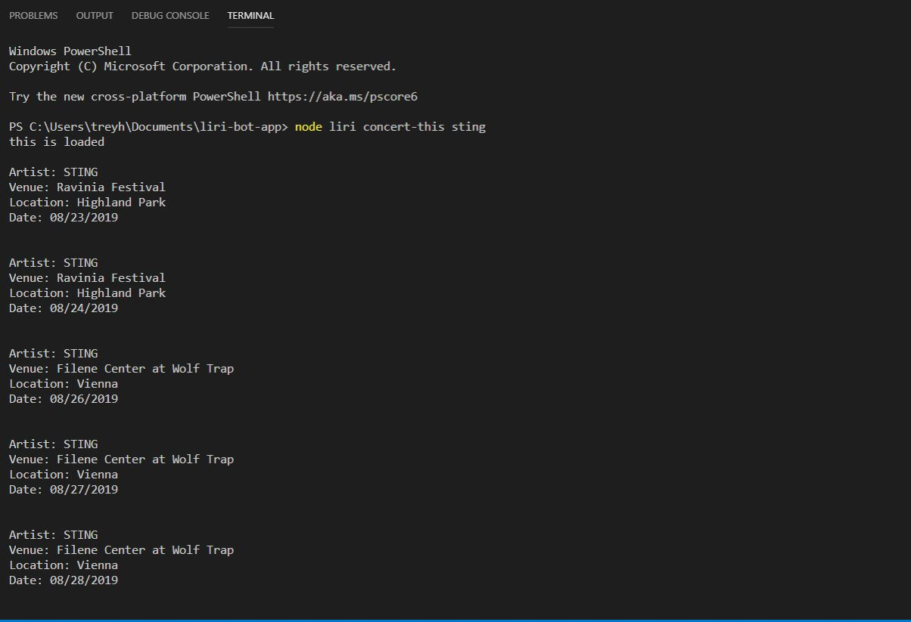
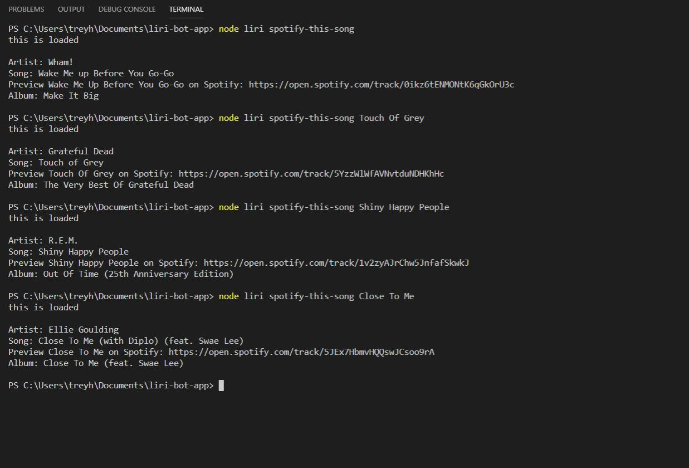
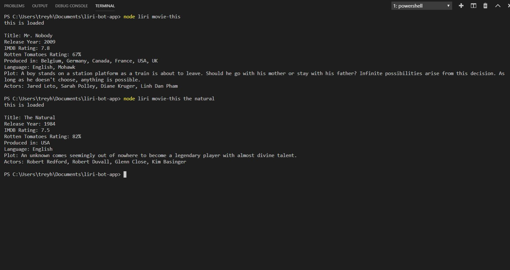
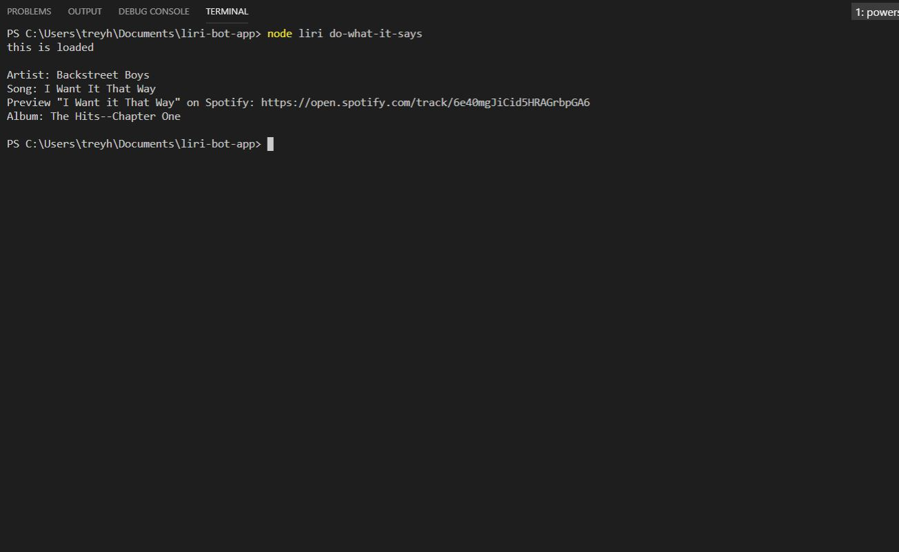

# LIRI Bot

This project is called Liri-bot-app. LIRI is like iPhone's SIRI. However, while SIRI is a Speech Interpretation and Recognition Interface, LIRI is a _Language_ Interpretation and Recognition Interface. LIRI will be a command line node app that takes in parameters and gives you back data.

LIRI will search Spotify for songs, Bands in Town for concerts, and OMDB for movies.

The Data retrieved that will power this app is using the `axios` package to the Bands in Town, Spotify and OMDB APIs. 

The following Node packages are used.

   * [Node-Spotify-API](https://www.npmjs.com/package/node-spotify-api)

   * [Axios](https://www.npmjs.com/package/axios)

   * [Moment](https://www.npmjs.com/package/moment)

   * [DotEnv](https://www.npmjs.com/package/dotenv)
   

Screenshots are added below to showed working function as LIRI takes in the following commands:

 ##  concert-this
   
_Below shows the app returning concert data when user enters the artist "Sting"._

      * Name of the venue
      * Venue location
      * Date of the Event (use moment to format this as "MM/DD/YYYY")
         

---

   
  ## spotify-this-song
   
_Below shows the app returning the default song "Wake me up before you Go-Go" when no song is entered, followed by two exmaples of songs entered by the user, "Touch of Grey" and "Close to Me"._

      * Artist(s)
      * The song's name
      * A preview link of the song from Spotify
      * The album that the song is from

  
  
  ---
  

   ## movie-this
   
_Below shows the app returning the default movie (Mr. Nobody) when no movie is entered and then returning data when "The Natural" movie is entered._

      * Title of the movie.
      * Year the movie came out.
      * IMDB Rating of the movie.
      * Rotten Tomatoes Rating of the movie.
      * Country where the movie was produced.
      * Language of the movie.
      * Plot of the movie.
      * Actors in the movie.

  
  
  ---
  

   ## do-what-it-says
   
 _Below shows input added into the Spotify search section using the (fs)npm package to retrieve data from .txt file._
 
      * Artist(s)
      * The song's name
      * A preview link of the song from Spotify
      * The album that the song is from

   
   
   ---   

### BONUS

* In addition to logging the data to your terminal/bash window, output the data to a .txt file called `log.txt`.

* Make sure you append each command you run to the `log.txt` file. 

* Do not overwrite your file each time you run a command.

